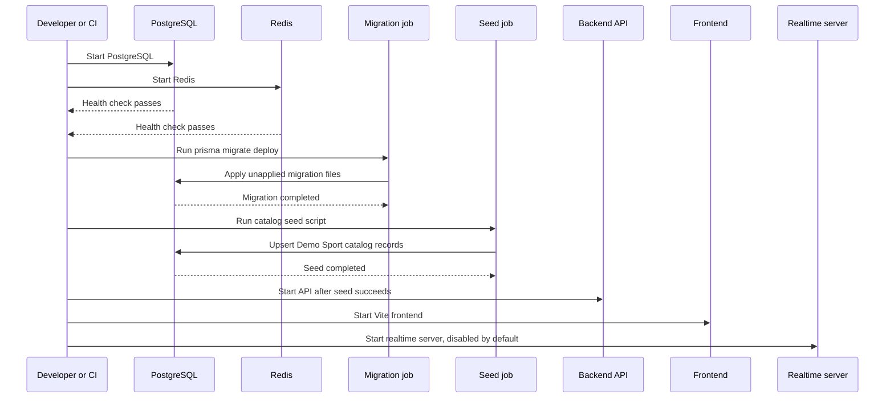
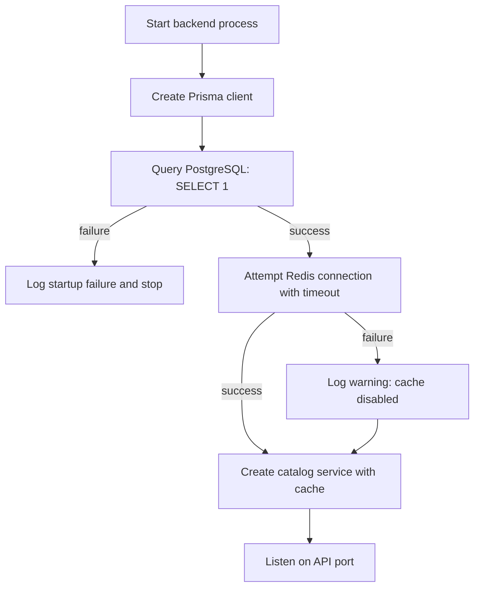
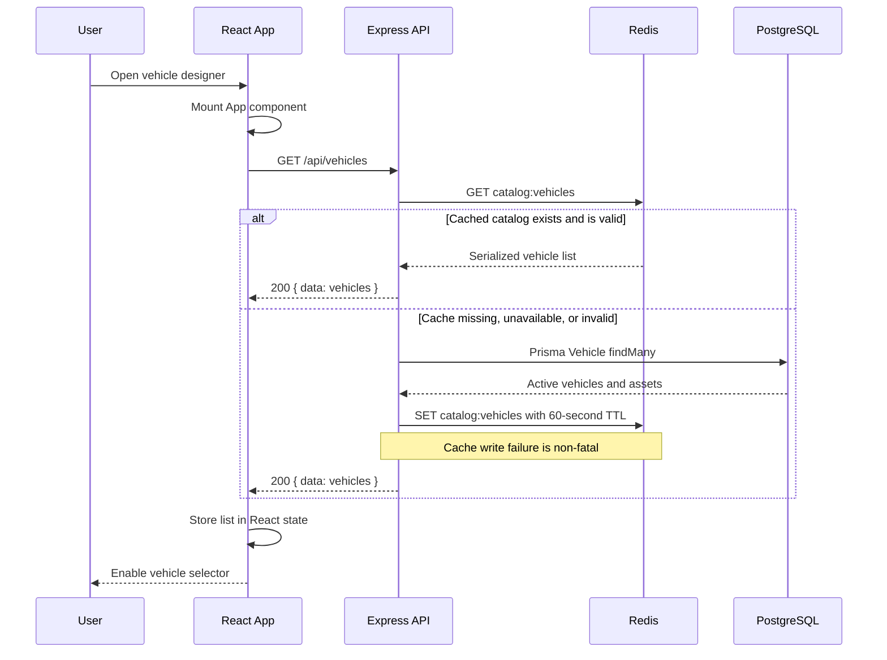
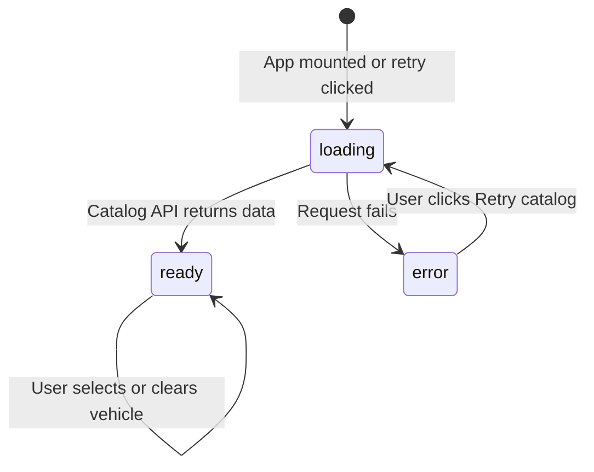
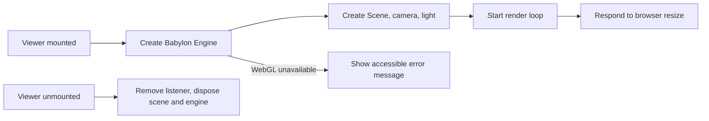
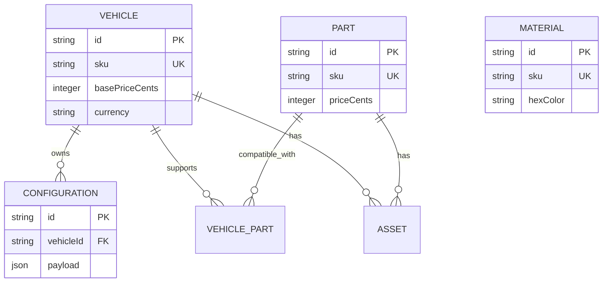
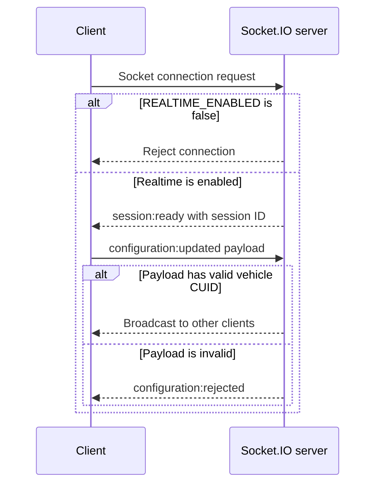
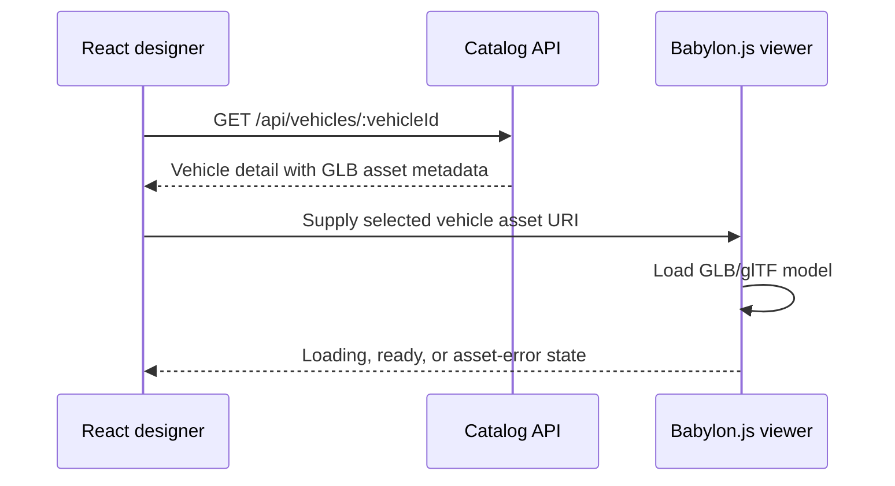

# Carsport Application Workflow

This document describes how the Carsport frontend, backend, realtime server, PostgreSQL database, Redis cache, and Docker development stack work together.

> **Current scope:** The catalog workflow is implemented and verified. The Babylon.js scene is active but does not yet load a vehicle GLB/glTF asset. The realtime service is deployed but intentionally disabled until authentication and persistent configuration handling are implemented.

## 1. System roles

| Component | Technology | Responsibility | Direct consumers |
| --- | --- | --- | --- |
| Frontend | React, Vite, Zustand, Babylon.js | Browser UI, catalog selection, 3D canvas lifecycle, future design interactions | End user; backend API |
| Backend | Node.js, Express, Prisma | HTTP API, domain orchestration, request validation, catalog response shaping | Frontend; future admin/sales clients |
| Database | PostgreSQL | Durable system-of-record for catalog, configuration, auth, and analytics data | Backend through Prisma only |
| Cache | Redis | Non-authoritative performance cache for catalog reads and future transient coordination | Backend |
| Realtime server | Node.js, Socket.IO | Future authenticated collaboration/event channel | Frontend, after realtime is enabled |
| Docker Compose | Docker | Local service lifecycle, networking, migrations, seeding, dependency ordering | Developers and CI |

## 2. Service topology

```mermaid
flowchart LR
    Browser[Browser]
    Frontend[Frontend<br/>React + Vite<br/>127.0.0.1:5173]
    Backend[Backend API<br/>Express + Prisma<br/>127.0.0.1:4000]
    Realtime[Realtime server<br/>Socket.IO<br/>127.0.0.1:5000]
    Redis[(Redis cache)]
    PostgreSQL[(PostgreSQL)]

    Browser -->|loads application| Frontend
    Frontend -->|REST /api/*| Backend
    Frontend -. future Socket.IO .-> Realtime
    Backend -->|read/write cache| Redis
    Backend -->|Prisma queries/mutations| PostgreSQL
```

The browser communicates with the backend through HTTP. It **never** accesses PostgreSQL or Redis directly. Prisma is the backend's data-access layer; PostgreSQL remains the actual database.

## 3. Docker startup workflow

The local stack is defined in [docker-compose.yml](../docker-compose.yml).



### Startup guarantees

1. PostgreSQL and Redis use health checks.
2. The migration job waits for PostgreSQL.
3. The seed job waits for a successful migration job.
4. The backend waits for PostgreSQL, Redis, and a successful seed job.
5. The database migrations are idempotent: already-applied migrations are not run again.
6. The seed script uses upserts, so repeat startup does not create duplicate demo records.

### Network exposure

The local Compose ports bind to `127.0.0.1`. This lets the browser access the frontend, API, and future realtime server locally without exposing PostgreSQL, Redis, or application ports to the local network.

## 4. Backend startup workflow

The API entry point is [backend/src/index.js](../backend/src/index.js).



### Connection rules

- **PostgreSQL is mandatory.** The backend cannot start without a usable database connection.
- **Redis is optional for read availability.** If Redis becomes unavailable after startup, catalog requests continue by querying PostgreSQL directly.
- **Prisma is the only database client.** There is no separate raw `pg` pool, avoiding duplicate connection pools and separate persistence conventions.
- **Shutdown is graceful.** The API stops accepting new HTTP requests, then disconnects Redis and Prisma.

## 5. Current catalog request workflow

The implemented catalog endpoint is the primary example of frontend-to-backend interaction.

### Browser request sequence



### Endpoint contracts

| Endpoint | Input | Success response | Failure response |
| --- | --- | --- | --- |
| `GET /health` | None | `200` with service status | `404` for unknown route |
| `GET /api/vehicles` | None | `200` with active vehicle summaries | `500` only for unrecoverable service/database error |
| `GET /api/vehicles/:vehicleId` | CUID vehicle identifier | `200` with vehicle, assets, and compatible parts | `400` invalid ID; `404` no active vehicle; `500` server error |

A vehicle summary contains an ID, SKU, name, description, base price in integer cents, currency, and optional thumbnail. Vehicle details add asset metadata and compatible component records.

### Why currency uses cents

Prices are stored and transported as integer cents, such as `4599000` for €45,990.00. Integer arithmetic avoids floating-point rounding errors during future price calculations.

## 6. Frontend catalog state workflow

The designer app is implemented in [frontend/src/App.jsx](../frontend/src/App.jsx). It holds catalog loading state locally and the selected vehicle in the Zustand store.



### Frontend responsibilities

1. Create an `AbortController` when the component mounts.
2. Call the catalog API through [frontend/src/features/catalog/catalogApi.js](../frontend/src/features/catalog/catalogApi.js).
3. Abort the pending request when the component unmounts.
4. Disable the selector while the catalog is loading or unavailable.
5. Display an explicit retry action after a request failure.
6. Store only the selected vehicle ID in Zustand. Full catalog data remains in the page state for the current session.

### 3D viewer lifecycle

[frontend/src/features/vehicle-viewer/VehicleViewer.jsx](../frontend/src/features/vehicle-viewer/VehicleViewer.jsx) creates Babylon.js resources when mounted and disposes them when unmounted.



Step 2 will connect the selected vehicle ID to a detail request and then load the returned vehicle GLB/glTF asset in this viewer.

## 7. Data persistence workflow

PostgreSQL data definitions live in [backend/prisma/schema.prisma](../backend/prisma/schema.prisma). Migration history is stored under [backend/prisma/migrations](../backend/prisma/migrations).



### Data integrity rules

- Vehicle, part, and material SKUs are unique.
- A configuration belongs to one vehicle and is deleted if its vehicle is deleted.
- Vehicle-part compatibility is modeled as a many-to-many relation with a composite primary key.
- An asset must belong to **exactly one** entity: either one vehicle or one part, never both and never neither.
- Foreign-key relationships use cascading deletes where appropriate.

## 8. Redis cache behavior

Redis is an optimization, not a source of truth.

| Operation | Current behavior |
| --- | --- |
| Catalog list cache key | `catalog:vehicles` |
| Expiration | 60 seconds |
| Cache hit | Return the cached serialized vehicle summaries |
| Cache miss | Query PostgreSQL through Prisma, then attempt to cache result |
| Redis read failure | Log warning and query PostgreSQL |
| Redis write failure | Log warning and return PostgreSQL result |
| Catalog update | Future write services must call cache invalidation before returning success |

The catalog service already exposes cache invalidation support. Future catalog create/update/delete routes must use it to prevent stale lists.

## 9. Realtime workflow and current safeguard

The realtime server in [server/src/index.js](../server/src/index.js) is deliberately **disabled by default** through `REALTIME_ENABLED=false`.



### Before enabling realtime for users

The following must be completed:

1. Authenticate the Socket.IO handshake using the same identity system as the HTTP API.
2. Authorize access to a specific configuration or collaboration room.
3. Validate the complete configuration schema, not only the vehicle ID.
4. Persist accepted configuration updates in PostgreSQL.
5. Publish/consume events through Redis when multiple realtime server instances are deployed.
6. Add rate limits, audit logs, and integration tests.

Until then, the frontend should not open a Socket.IO connection.

## 10. Error handling and recovery

| Failure | Current behavior | User-facing result |
| --- | --- | --- |
| PostgreSQL unavailable at startup | Backend logs failure and does not listen | Catalog unavailable; frontend retry remains available |
| Redis unavailable at startup | Backend starts with cache disabled | Catalog still works from PostgreSQL |
| Redis fails during catalog request | Service logs warning and falls back to PostgreSQL | No interruption if database is available |
| Database fails during catalog request | Express returns generic `500` | Catalog error state with Retry action |
| Invalid vehicle identifier | API returns `400` | Future client route should show validation feedback |
| Missing vehicle | API returns `404` | Future client route should show an unavailable vehicle state |
| WebGL unavailable | Viewer shows an accessible fallback | User can still interact with non-3D UI |
| Container shutdown | API and realtime server close gracefully | Active requests/connections get orderly termination |

## 11. Development and continuous integration workflow

### Local developer workflow

1. Create `.env` from `.env.example`.
2. Start the stack with Docker Compose.
3. Compose migrates PostgreSQL and seeds demo catalog data.
4. Open the frontend on port `5173`.
5. Select Demo Sport from the live API-backed catalog.
6. Use the API health endpoint to confirm backend availability.

### CI workflow

[.github/workflows/verify.yml](../.github/workflows/verify.yml) runs for pushes to `main` and pull requests:

1. Install frontend dependencies with the lockfile.
2. Lint frontend source.
3. Build the production frontend bundle.
4. Build and start the Docker Compose stack.
5. Run HTTP catalog integration tests from the backend container.
6. Stop containers and remove test volumes even if an earlier step fails.

## 12. Boundary rules for future development

The following rules prevent domain leakage as the project grows:

- React components call API modules, not Prisma, Redis, or direct database clients.
- Express routes validate HTTP input and delegate business behavior to domain services.
- Domain services use Prisma repositories/data access and own cache invalidation decisions.
- PostgreSQL owns persistent domain state; Redis stores only recoverable cached or transient data.
- Socket.IO does not bypass backend validation, authorization, or persistence rules.
- Babylon.js consumes approved asset and configuration data; it does not decide catalog compatibility or pricing.
- Rule-engine and pricing-engine services will receive validated configuration data through backend contracts, not from arbitrary browser payloads.

## 13. Step 2 integration point

The next approved implementation step will extend the current workflow as follows:



Step 2 must keep the existing API and database boundaries intact while adding only asset loading, viewer loading states, and camera controls.
